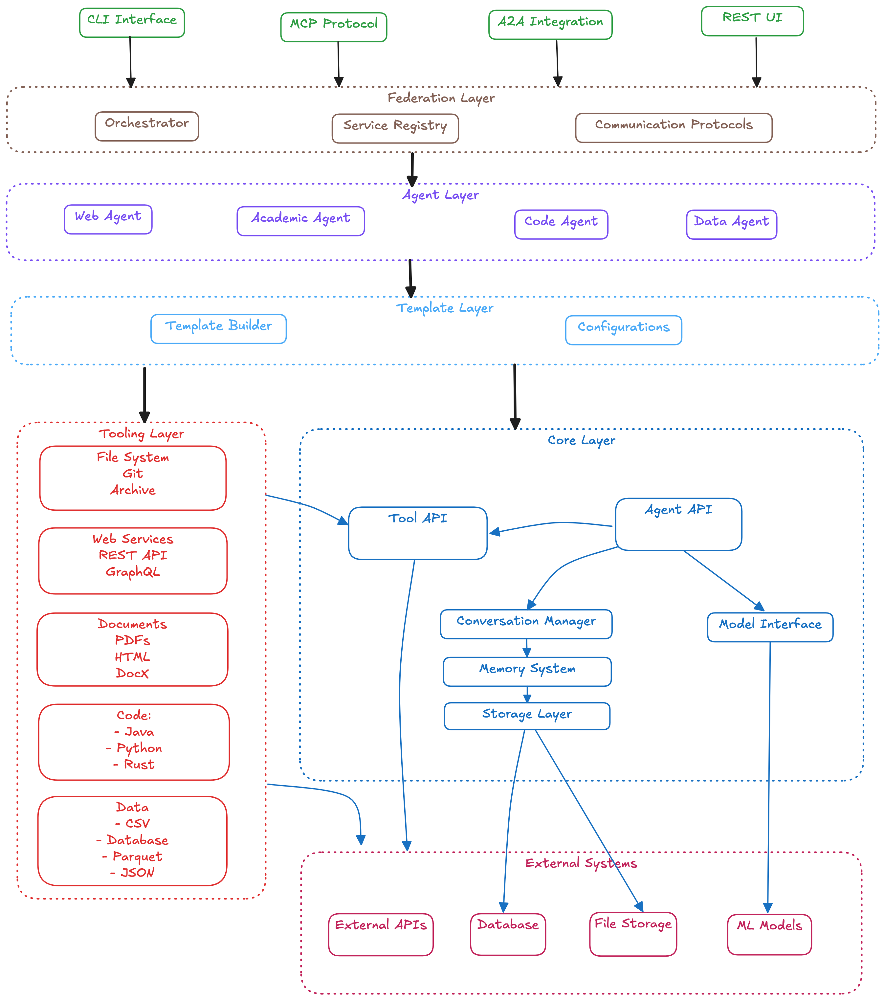

# Introduction

> "AI agents are like pets – they're cute, but they make a mess."  
> "The future is modular, and so is Kowalski. Want a feature? Open an issue or submit a PR!"

A sophisticated Rust-based multi-agent framework for interacting with various LLM providers, with built-in support for federation, secure multi-party computation, and extensible tooling architecture.

## Vision & Architecture

Kowalski is designed as a foundational framework for building intelligent, distributed agent systems that can collaborate securely and efficiently. The architecture supports both standalone operation and federated deployments with advanced privacy-preserving capabilities.



## Module Structure

```
kowalski/
├── kowalski-core/           # Core agent abstractions, conversation, roles, config, toolchain
├── kowalski-tools/          # Pluggable tools (code, data, web, document, etc.)
├── kowalski-federation/     # Multi-agent orchestration (WIP)
├── kowalski-academic-agent/ # Academic research agent
├── kowalski-code-agent/     # Code analysis agent
├── kowalski-data-agent/     # Data analysis agent
├── kowalski-web-agent/      # Web research agent
├── kowalski-cli/            # Command-line interface
├── resources/               # Configs, tokenizer, etc.
└── ...                      # Examples, docs, etc.
```

## Getting Started

This documentation will guide you through:
- **Installation and Setup** - Getting Kowalski running on your machine
- **Core Concepts** - Understanding the architecture and key technologies
- **Agent Development** - Creating and customizing agents
- **Advanced Topics** - Memory systems, federation, and tooling
- **Use Cases** - Real-world applications and examples
